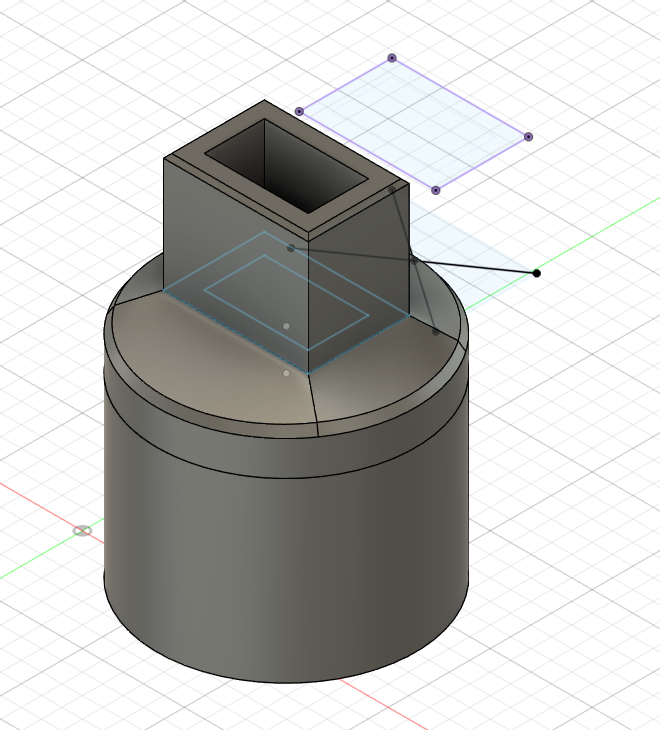
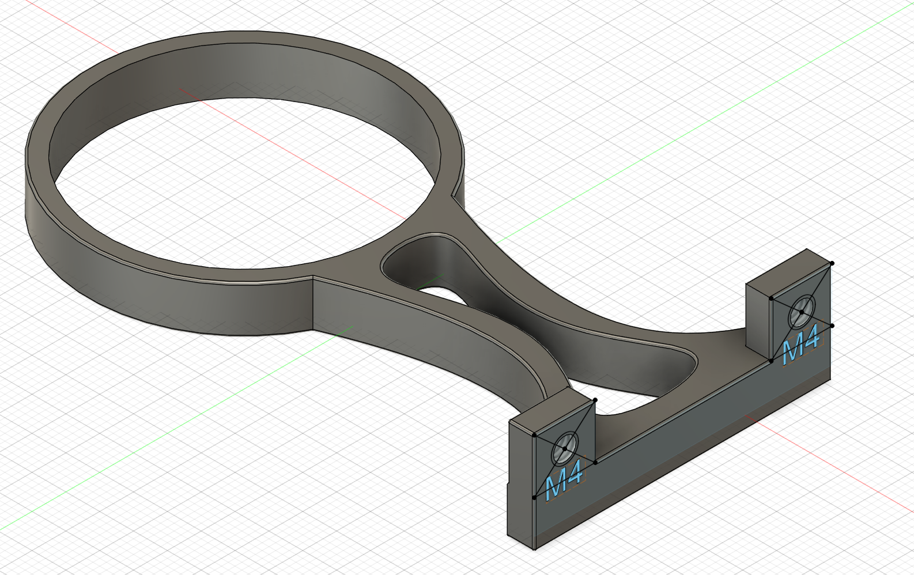

# autoruuti
Automatic power dispenser for ammunition reloading use.

Don't want to spend 1500 USD for a precision automatic powder dispenser? Build your own.
Cost for the electronics is less than 50 €, plus a laboratory scale worth about 290 €.

See [my youtube video](https://www.youtube.com/watch?v=Eo732I7xDfE&t=23s) for a short demo.

## Required hardware
These are what I used. I am not affiliated with any of these manufacturers or shops.

* [Laboratory scale KERN EMB-V 200-3V](https://vaakaekspertti.fi/laboratoratoriovaaka-kern-emb-v.html). I believe any KERN scale with RS-232 port should work, but verify that it supports the [KERN KCP protocol](https://dok.kern-sohn.com/manuals/files/English/KCP-ZB-e-v1.3.7.pdf).
* [TTL-RS232 converter](https://www.aliexpress.com/item/1005003091082827.html)
* [Arduino Uno R3 (clone)](https://www.aliexpress.com/item/1005003363526075.html)
* [LCD keypad shield (clone)](https://www.aliexpress.com/item/1005004889066625.html)
* [28BYJ-48-5V 4 phase stepper motor + ULN2003 controller board](https://www.aliexpress.com/item/1005004566735226.html)
* [Frankford Arsenal powder dispenser](https://www.metsovaruste.fi/metsastysmaailma/ruutisirotin-frankford-arsenal/p/60-025-3985/). You can use any other powder dispenser, but the included 3D model for the mechanical adapter & holder will probably not fit and adjustments will be needed.
* A 5 volt power supply directly connected to the 5V rail of the Uno board. Do not use the included 12V to 5V DC converter, it will not supply enough power for the stepper motor and you will have problems.
* A male to male RS-232 serial cable. I made my own cable from DB9 male connectors. Only TXD, RXD & GND are required (and rx/tx needs to be cross connected of course).
* A 3D printer capable of printing at least PLA. I used PETG but PLA and others should work just fine. Almost any printer will do.

## Electronic assembly

* Place LCD keypad shield on top of the arduino uno board.
* Connect 5V rail directly to the 5V rail of Uno and GND to Uno GND.
* Also connect power supply 5V & GND directly to the ULN2003 controller board.
* Connect 5V & GND to ULN2003 5V & GND.
* Connect IN1, IN2, IN3, IN4 of ULN2003 to Uno pins A5, A4, A3 and A2.
* Connect serial converter RX to D3 and TX to D2
* Recommended: USB-A male connector for supplying power to the unit. I use a USB-A male connector to power the device and I've found it works best for me. I can even power the device using a power bank.

See [Arduino UNO pinout diagram](https://images.prismic.io/circuito/8e3a980f0f964cc539b4cbbba2654bb660db6f52_arduino-uno-pinout-diagram.png?auto=compress,format).

## Mechanical assembly ##

### Main case ###
* I used an [Arduino case I found from thingiverse](https://www.thingiverse.com/thing:3362327) and cut off a piece to make the display assembly fit. Print and install with screws.
* ULN2003 board can fit inside but needs an enclosure of some thing, I just used electrical tape.
* I cut off a bit to fit the TTL converter to the side.
* Better enclosure would be nice but I didn't have time to CAD model it yet. Please, share your model if you draw one.

### Powder dispenser ###
* Print cadfiles/dispenser_axle_adapter: 

* Print cadfiles/motor_mount

* Assemble the model as seen in the youtube video. It's a tight fit but worked for me.

## Software

* Install [Arduino IDE] (https://www.arduino.cc/en/software)
* Install a few arduino libraries:
   * [Regexp by Nick Gammon](https://github.com/nickgammon/Regexp)
   * [LCDKeypad by dzindra](https://github.com/dzindra/LCDKeypad)
* Other built-in libraries used: Stepper, SoftwareSerial, EEPROM. These do not require any 3rd party downloads.

* Flash autoruuti.ino with Arduino IDE using the included USB-A - USB-B cable.
* You should see startup texts when powering the device. If not, then your display is not properly connected.

## Usage

* Menu/UI is in finnish. Contact me if you wish to use it but don't speak finnish, I can provide a translation :)
* Default values will be loaded on first boot.
* Hold the SELECT button to enter menu.
* Short press the SELECT button to enter/leave pause mode.
* Use LEFT/RIGHT keys to navigate the menu.
* Use UP/DOWN keys to change the setting: short press for a small change and long press for a large change.
* Settings are saved automatically within 5 seconds of modification. Changing the settings often will not burn out your EEPROM.
* Rightmost button is reset and will perform a hardware reset (EEPROM settings will not be lost)
* Adjust speeds to match your powder and stepper/board combination.

### Notes on accuracy of the KERN EMB-V 200

* Always ZERO your scale between cases! As the [KERN EMB-V manual](https://dok.kern-sohn.com/manuals/files/English/EMB-V-BA-e-1624.pdf) mentions, it is not accurate for dynamic add-on weighing procedures:
> Do not use balance for dynamic add-on weighing procedures, if
> small amounts of goods to be weighed are removed or added.
> The “stability compensation“ installed in the balance may result
> in displaying an incorrect measuring value!
> (Example: Slowly draining fluids from a container on the balance.)

Technically, using the scale for powder measurement is Improver use as per the definition in manual, however I have found out that the accuracy is more than enough if you don't keep adding/removing powder for a long time and zero between measurements.
You can achieve maybe about +/- 2 mg of accuracy with correct use and settings.

# License

[CC BY-NC-SA 4.0](https://creativecommons.org/licenses/by-nc-sa/4.0/)

Not for commercial use. Please contact me if you wish to sell these.
If you think some other license would work better, let me know.
